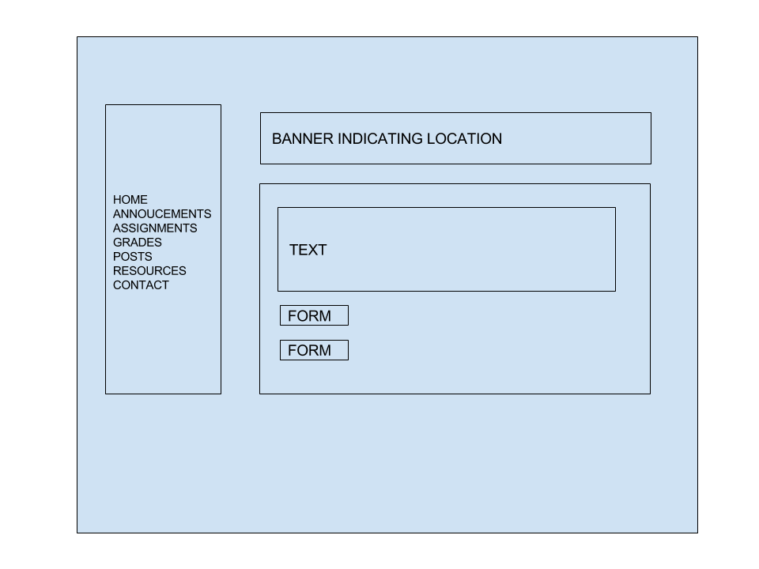
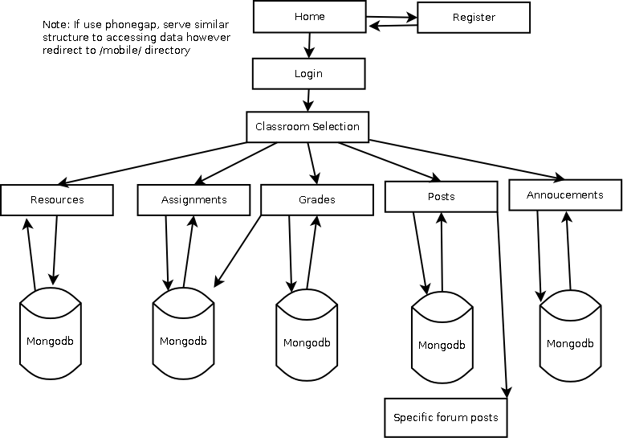

# Open source blackboard (nodeboard)

**NOTE THIS PROJECT IS NOW DEFUNCT, A NEWER UPDATED VERSION WILL BE MADE READILY AVAILABLE UTILIZING REACT.JS**

## Overview

This project will replicate (possibly improve) the blackboard application used by colleges (for NYU this is NYUClasses) and the idea is to provide an open source solution for schools that cannot afford the cost of blackboard but still desire the functionality provided by blackboard.

nodeboard is designed to be a learning management system. It provides the teachers with an online collaborating classroom portal to enhance the learning experience. It provides teachers  with the ability to make resources available to their students, provide them with additional online help and support through a forum Q&A section and allow teachers to create announcements that can push updates on assignments via either email or sms. In addition teachers can also provide feedback on assignments and utilize a grade-book application to manage the grades of their students.

nodeboard may be designed with the intention of each noadboard hosts a single school. This is because Node.js is relatively easy to deploy on systems such as heroku. That means authentication is only limited to teacher vs student. This eliminates the issue of authenticating a student (or teacher) of a similar class but offered in different schools. 


## Data Model

Most likely MongoDB for simplicity.

Minimally, we'll have a Users, Resources, Class, Assignments, and Posts.

Users
* Authorization based on token, to determine if student or teacher
  * additional possible authorization to determine if student of certain class or school

Class
* lists all the students enrolled in a certain class
  * determines the accessibility of the class and what they can pos (multiple teachers, graders, etc)

Resources
* only can be uploaded by moderators of class
  * can be documents or links
  * can be pushed for notification (check box field for notification)

Assignments
  * created by moderators (specifies date field)
    * student can be upload document or write a text file and submit assignment via form

Posts
  * can be created by any member of the class
    * can be responded to by any member of the class


First draft schema:

```javascript
// users
//site requires authorization the moderator flag can possibly be replaced?
//and moved to the class field, but it seems easier to redirect users if they are signing up to
//become teachers or students.
var UserSchema = new Schema({
    first_name: {type: String, required: true},
    last_name: {type: String, required: true},
    username: { type: String, required: true, index: { unique: true } },
    email: {type:String, required, true, unique:true},
    password: { type: String, required: true },
    moderator: {type: Boolean, required: true} //note have to figure out how to hide this field on registration
});

//classroom determines
var Classroom = new mongoose.Schema({
  name: {type: String, required: true},
  /*might have to research how to populate with a list of users, if not, i can enumerate through all classrooms with name==name and id==unique_id*/
  students: [UserSchema],
  moderator: [UserSchema], //same issue with users
});

var Assignment = new moongose.Schema({
  name: {type: String, required: true},
  date: {type: Date, required:true },
  description: {type: String, required: true},
  documents: {type: upload_model, required: false},
  classroom: {type: Integer, required:true}, //classroom id from drop down list?
});

var studentAssignment = new mongoose.Schema({
    assignment: [Assignment],
    username: [UserSchema], //student id
    date: {type: Date, required: true}, //automatic set date and time
    document: {type: upload_model},
    text: {type: String}
});

var Grade = new mongoose.Schema({
  assignment: [Assignment],
  username: [UserSchema],
  grade: {type: String, require: true}, //string coz alpha-numeric characters or numeric characters (A+ or 100)
  feedback: {type: String, required: false},
  document: {type: upload, required: false} //possibly a document with annotations
})

var Resource = new mongoose.Schema({
  name: {type: String, required: true},
  date: {type: Date, required: true},
  notify: {type: Boolean, required: true}, //push to email or sms
  description: {type: String, required: true},
  document: {type: upload, required: false} //optional document field pdf or something
});

//note I'm debating on doing the posts cause essentially its creating a mini forum site, which in itself might be a lot of overhead, but posts basically will have similar fields to assignment, but an additional field with a unique id for the post, so when they reply, we can manage where the replies go, and use date to determine order.
```

## Wireframes



## Sitemap



## Reserach Topics


* (3 points) Integrate user authentication
    * I'm going to be using passport for user authentication
    * simple registration to determine if student or teacher, possibly additional verification if teacher
* (2 points) Perform client side form validation using a JavaScript library
    * lots of error checking to ensure that proper values are passed
* (1 point) Bootstrap
  * to make it look pretty?
* (Optionally: 1 point or moars? ) PhoneGap
  * to possibly add mobile support such as viewing resources more easily on mobile since most students need this feature
* (Optionally: 2 points) use awesome js library that i found
  * Twilo or similar SMS application to send SMS notifications and email updates


* ... for total of 6 points (or maybe 9 which translates to an automatic A+ for the class! :) )
    * ideas such as twilo and phonegap will not be primary concern and therefore might be abandoned depending on progress
